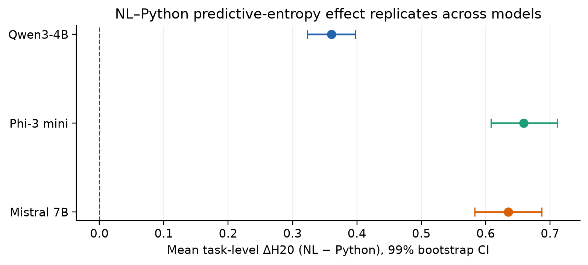
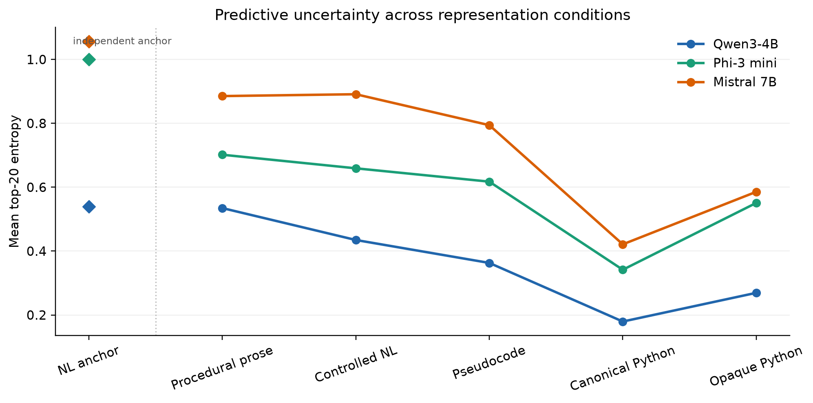
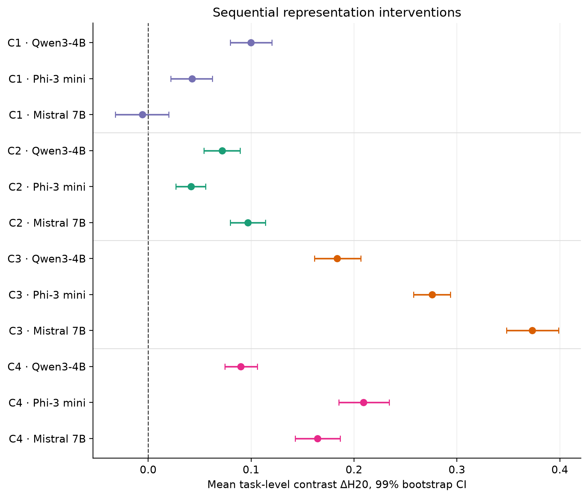
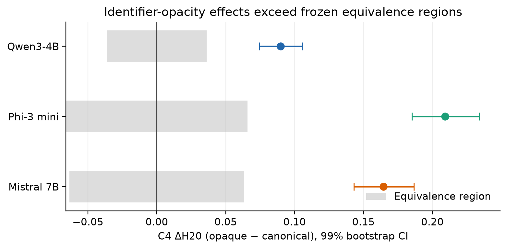

# Representation-Dependent Predictive Uncertainty in Autoregressive Language Models

**Yedil Nurakhov**  
Department of Computer Science, Al-Farabi Kazakh National University, Almaty, Kazakhstan  
Email: y.nurakhov@gmail.com  
ORCID: 0000-0003-0799-7555

## Abstract

The same underlying procedure can be expressed as ordinary prose, controlled natural language, pseudocode, or executable code. We ask whether the predictive uncertainty of an autoregressive language model depends on this choice of representation. On a frozen set of 100 procedural tasks, we measure next-token distributions along complete reference solutions under teacher forcing. At each step, the model receives the reference prefix, and the next-token distribution is measured before the next reference token is appended. Our primary metric is the mean entropy of the distribution over the 20 most probable next tokens after renormalizing their probabilities to sum to one. Statistical inference is performed at the task level, with additional robustness checks across 50 task families.

In Study 1, Qwen3-4B showed a mean entropy difference of 0.3605 between natural-language and Python references, positive for all 100 tasks. The direction replicated in Phi-3 (0.6592) and Mistral (0.6353), again for 100 of 100 tasks in each model. Sequential representation comparisons showed consistent entropy reductions from controlled natural language to pseudocode and from pseudocode to canonical Python across all three models. Replacing canonical identifiers with opaque names while preserving scope increased entropy. By contrast, the transition from procedural prose to controlled natural language did not replicate in Mistral.

These results show a cross-model but transition-specific relationship between representation and the concentration of the next-token predictive distribution. They do not establish a universal ordering of representations, do not imply that lower entropy means greater correctness, and do not isolate a single causal mechanism.

## 1. Introduction

An autoregressive language model predicts the next token conditional on the preceding context. If the same content is written as ordinary prose, controlled natural language, pseudocode, or Python, the underlying procedure may remain the same while the space of plausible continuations changes. Each representation imposes its own lexical regularities, syntactic constraints, and recurring structures. A model may therefore distribute probability over possible next tokens differently even when the underlying task is unchanged.

This distinction matters for two reasons. First, it helps separate task content from the form in which that content is presented to the model. Second, representations that induce more concentrated predictive distributions may be useful for controlled generation, routing, or intermediate computation. Predictive concentration alone, however, says nothing about whether a continuation is correct: a model can continue either a correct or an incorrect sequence with low entropy.

Directly comparing representations is complicated by the generation process. Variation among sampled outputs depends not only on the model but also on temperature, decoding strategy, and previously sampled tokens. Comparing isolated token positions can also be misleading: prose may end at a position with many plausible linguistic continuations, whereas code may reach a position where syntax strongly constrains the next token. Such comparisons may capture accidental local differences rather than a representation-level effect.

We use a different design. Each task is paired with reference solutions in multiple representations. The model receives a common task description and the prefix of a reference solution; before the next reference token is appended, we measure the full next-token predictive distribution. This teacher-forced design measures uncertainty along complete fixed trajectories without confounding it with sampling decisions.

We address three research questions:

1. Does predictive entropy differ between matched natural-language and Python solutions on a frozen set of tasks?
2. Does the direction of this difference replicate across independently trained model families with different tokenizers?
3. At which transitions between prose, controlled natural language, pseudocode, and Python does the difference emerge, and what happens when canonical identifiers are replaced with opaque names?

The paper reports three studies. Study 1 compares natural language and Python on 100 tasks using Qwen3-4B. Study 2 repeats the same comparison, without changing the task set or analysis scheme, using Phi-3 and Mistral. Study 3 replaces the binary comparison with a sequence of controlled representation conditions and a separate identifier manipulation. The primary unit of statistical inference is the task rather than the token or individual reference variant; an additional robustness analysis is performed across 50 task families.

The paper makes five contributions:

1. it provides a matched design for measuring predictive uncertainty along complete reference trajectories expressed in different representations;
2. it replicates the direction of the natural-language-minus-Python effect across three independently trained model families;
3. it shows that the effect is transition-specific rather than a universal monotonic ordering by formality;
4. it identifies a reproducible increase in entropy when canonical identifiers are replaced by opaque names while preserving scope;
5. it retains the negative Mistral result for the procedural-prose-to-controlled-language transition, thereby constraining the general claim.

## 2. Related Work

The naturalness hypothesis of software argues that source code contains recurring statistical structure that can be exploited by language models [Hindle et al., 2012]. Subsequent work systematized probabilistic modeling of code and described both similarities and differences between programming and natural languages [Allamanis et al., 2018]. We do not claim to be the first to show that code can be locally predictable. Our question is narrower: how does the predictive distribution change when the same procedural content is expressed in several matched representations?

A separate line of work treats code or pseudocode as a representation for reasoning. Code prompting converts natural-language problems into code-like inputs and can improve performance on several conditional-reasoning tasks [Puerto et al., 2024]. Think-and-Execute represents reusable task-level logic as pseudocode and reports that pseudocode guidance can outperform natural-language guidance on algorithmic reasoning tasks [Chae et al., 2024]. At the same time, code prompts are not uniformly beneficial across tasks, and their effectiveness can depend strongly on prompt style [Zhang et al., 2023]. These studies primarily evaluate downstream task performance. Our focus is instead the predictive distribution itself along fixed, matched reference trajectories.

Predictive entropy must also be distinguished from calibrated confidence and correctness. Modern neural networks can be poorly calibrated [Guo et al., 2017], and probabilities produced by generative language models need not correspond to the probability that an answer is correct [Jiang et al., 2021]. Recent work evaluates uncertainty in language models using rank calibration [Huang et al., 2024], separates uncertainty over meaning from uncertainty over alternative surface forms [Farquhar et al., 2024], and distinguishes epistemic from aleatoric uncertainty [Ahdritz et al., 2024]. Our study directly accesses the next-token distribution along fixed references. Low entropy is therefore not interpreted as truth, knowledge, or calibrated confidence.

Most directly related to our measurement question, Zhu et al. [2026] conduct a systematic token-level comparison of natural-language and code generation and show that decoding difficulty in code is concentrated at structurally important positions, particularly line-initial tokens. Their structural intervention reduces predictive entropy at those positions. This work establishes that predictive uncertainty differs meaningfully across natural-language and code-generation settings and that uncertainty within code is structurally localized. Our design addresses a different axis: we hold procedural content fixed, compare matched representations of the same task, decompose the natural-language-to-Python difference into intermediate representation transitions, and aggregate the resulting contrasts at the task level across multiple model families.

Next-token entropy and surprisal are standard token-level measures of sequential prediction, whereas generalized anticipatory and responsive measures may capture additional information [Giulianelli et al., 2024]. The primary outcome in the present study is predictive entropy; surprisal is recorded as a trajectory-level diagnostic rather than used as a primary inferential endpoint. The methodological contribution here is the matched full-trajectory design, task-level aggregation, cross-model replication, and analysis of sequential representation interventions.

A particularly relevant line of work concerns identifiers and tokenization. Identifier-aware pretraining can improve code understanding and generation [Wang et al., 2021], while identifier anonymization can help models handle rare names [Chirkova and Troshin, 2021]. Miceli Barone et al. [2023] show that language models can be highly sensitive to identifier swaps in Python even when program semantics are nearly invariant to such renaming. TokDrift applies semantics-preserving code rewrites and shows that superficial changes, including identifier naming, can alter subword tokenization and model behavior [Li et al., 2026]. Our C4 analysis therefore does not claim that sensitivity to identifier form is new; instead, it places an identifier manipulation within the same representation-comparison framework used for prose, controlled natural language, pseudocode, and canonical Python, and tests whether the direction of the effect replicates across models.

Taken together, prior work establishes that code is statistically regular, that code-like representations can change reasoning performance, that natural-language and code generation differ in token-level uncertainty, and that surface-level code transformations can alter model behavior. Our contribution is therefore not a generic text-versus-code predictability claim. We study how predictive concentration changes across matched representations of the same procedural content, using teacher-forced full reference trajectories to localize the natural-language–Python difference to particular representation transitions and to test their task-level robustness across model families.

## 3. General Methods

### 3.1. Tasks and grouping

The frozen corpus contains 100 procedural tasks organized into 50 families of two tasks each. In Studies 1–2, each task has three natural-language references and three Python references. Study 3 contains three variants for each of six conditions, yielding 1,800 trajectories per model.

For illustration, the examples below show four tasks and matched reference solutions from the frozen corpus. The examples were selected to illustrate different types of procedures rather than by observed effect size. The full corpus contains all 100 tasks and all reference variants.

**Corpus examples: tasks and matched representations**

| Family | Task | Example natural-language reference | Example Python reference |
| --- | --- | --- | --- |
| `parity_count` | Given a list of integers, count how many values are even. | Start a counter at zero. Examine every integer. Whenever the current value is even, increase the counter by one. Return the counter after all values are processed. | `count = 0; for value in values: if value % 2 == 0: count += 1; return count` |
| `binary_search` | Given an ascending sorted list and a target value, return the target index or minus one if absent. | Set low and high indices around the search range. Repeatedly inspect the middle value, returning its index on a match. Discard the half that cannot contain the target. Return minus one if the range becomes empty. | `low = 0; high = len(values) - 1; while low <= high: middle = (low + high) // 2; ...` |
| `fibonacci` | Given a nonnegative integer n with F0 equal to zero and F1 equal to one, return Fn iteratively. | Start with the pair zero and one. Repeat n times, replacing the pair with the second value and the sum of the two values. Return the first value. | `a = 0; b = 1; for _ in range(n): a, b = b, a + b; return a` |
| `diagonal_aggregate` | Given a square matrix, calculate the sum of its anti-diagonal. | Start a total at zero. For every row index, add the element whose column index is the mirrored position from the right. Return the total. | `for row in range(size): total += matrix[row][size - 1 - row]; return total` |

The natural-language and program references specify the same target procedure but differ in how that procedure is represented sequentially. In Studies 1–2, each task uses three variants of each representation so that the primary result does not depend on a single wording or a single choice of variable names.

The task files used in Studies 1–3 share the same SHA-256 checksum:
`dcdbc196f7dbf394fbf043690c764c470dbbbf9ee333e344c1f62f320a72a164`.

### 3.2. Models

The cross-model study uses Qwen3-4B, Phi-3-mini-4k-instruct, and Mistral-7B-Instruct-v0.3 with BF16 computation. The immutable model revisions used for the retained runs are:

- Qwen/Qwen3-4B: `1cfa9a7208912126459214e8b04321603b3df60c`;
- microsoft/Phi-3-mini-4k-instruct: `f39ac1d28e925b323eae81227eaba4464caced4e`;
- mistralai/Mistral-7B-Instruct-v0.3: `c170c708c41dac9275d15a8fff4eca08d52bab71`.

The exact Qwen revision for the completed Study 1 run was not recorded at execution time and was subsequently reconstructed from the corresponding local Hugging Face cache snapshot. The same reconstructed revision was pinned explicitly for the later Study 3 Qwen run. The Phi-3 and Mistral revisions were retained directly in their run configurations.

### 3.3. Prompt and teacher forcing

Each trajectory uses the exact raw continuation format

```text
Task:
<task>

Solution:
<reference>
```

without a chat template and without an instruction naming the target representation. The model is not used in dialogue mode; the sequence is treated as ordinary autoregressive text continuation, and the next-token distribution is evaluated at each step. The prompt and full reference are tokenized as a single sequence. The implementation checks token-boundary alignment or explicitly handles the boundary case. The first reference token is excluded from the primary trajectory mean because its preceding context is identical across representations.

### 3.4. Metrics

The primary metric is the entropy of the distribution over the 20 most probable next tokens after their probabilities are renormalized to sum to one (hereafter, top-20 entropy). If `p_i` denotes the model probability of the `i`-th token among the top 20, we define

\[
q_i = \frac{p_i}{\sum_{j=1}^{20} p_j}, \qquad
H_{20} = -\sum_{i=1}^{20} q_i \log q_i.
\]

Study 1 additionally measures entropy over the full model vocabulary. Studies 2–3 additionally measure entropy over the tokenizer-valid vocabulary, excluding output IDs that are not valid tokenizer entries; we refer to this robustness metric as valid-vocabulary entropy.

Study 3 also uses top-20 entropy balanced by semantic steps. A semantic step is a non-overlapping span of a derived representation corresponding to one element of the shared intermediate procedure, such as initialization, a condition, an update, or returning the result. Each analyzable token belongs to at most one step. Entropy is first averaged within each represented step, and step-level means then receive equal weight. The original frozen natural-language reference condition used as an anchor is excluded from this analysis because it was not generated from the shared intermediate representation.

Lower entropy is interpreted as a more concentrated predictive distribution, not as truth, solution correctness, or semantic understanding.

### 3.5. Aggregation and statistical inference

Tokens and reference variants are treated as repeated observations. Trajectory-level metrics are first averaged within each task and condition, making the task the primary unit of statistical analysis (*N* = 100). Additional robustness checks are conducted across 50 task families (Appendix Table A2).

For brevity, four predefined pairwise condition contrasts are denoted C1–C4:

- C1: procedural prose − controlled natural language;
- C2: controlled natural language − pseudocode;
- C3: pseudocode − canonical Python;
- C4: Python with opaque identifiers − canonical Python.

The randomization analyses use 200,000 sign-flip resamples and 100,000 bootstrap resamples with random seed `20260916`. Bootstrap intervals are percentile 99% intervals over tasks. The natural-language-minus-Python tests in Studies 1–2 and the directional Study 3 contrasts C1–C3 use one-sided sign-flip tests in the positive direction; C4 uses a two-sided sign-flip test. In Study 3, Holm correction is applied to the four predefined contrasts C1–C4 separately within each model; the adjusted *p*-value threshold is 0.01. Cohen’s d<sub>z</sub> in Table 1 is the mean paired task-level difference divided by the sample standard deviation of those paired differences.

For the directional contrasts C1–C3, the primary result is considered supported when the mean difference is positive, the 99% interval lies entirely above zero, the adjusted *p*-value is below 0.01, and the positive direction is observed in at least 70 of 100 tasks and 35 of 50 task families. The status “Robust” additionally requires the effect direction to agree in the valid-vocabulary and semantic-step-balanced analyses. For C4, we use the same adjusted *p*-value threshold, a 99% interval excluding zero, and the same task- and family-level prevalence thresholds; “Robust” again requires agreement in direction across the two additional metrics. Practical-equivalence bounds for C4 were defined before the Study 3 analysis at 10% of the previously measured natural-language-minus-Python effect for each model separately. Practical equivalence requires the 99% interval for C4 to lie entirely within the corresponding bounds. Numerical values for the additional metrics and equivalence bounds are reported in Appendix Table A1.

## 4. Study 1: Natural Language vs. Python in Qwen3

Study 1 tests the baseline contrast between natural-language and program representations of the same procedure. Each of the 100 tasks has three natural-language reference solutions and three Python reference solutions, yielding 600 trajectories. All trajectories are evaluated with Qwen3-4B under teacher forcing with direct access to logits. For each task, metrics are first averaged across the three variants of each representation, and the resulting natural-language and Python means are then compared.

The completed direct BF16 run contains 600 unique valid trajectories. Mean top-20 entropy was 0.5395 for natural-language references and 0.1790 for Python references. Natural-language trajectories therefore had, on average, a less concentrated next-token distribution. The mean task-level difference H<sub>NL</sub> − H<sub>Python</sub> was 0.3605, with a 99% bootstrap interval of [0.3231, 0.3977]. The difference was positive for all 100 tasks: for every task, mean entropy was higher for the natural-language references than for the corresponding Python references.

Full-vocabulary entropy produced the same direction, with a mean difference of 0.3787 and a 99% interval of [0.3370, 0.4204]. The observed result is therefore not specific to restricting the primary metric to the 20 most probable tokens.

The Qwen3 result and the subsequent cross-model replications are summarized in Table 1 ([machine-readable version](generated/table_1_replication.csv)).

**Table 1. Replication of the natural-language-minus-Python entropy contrast**

| Study | Model | Mean H<sub>NL</sub> − H<sub>Python</sub> | 99% bootstrap interval | Positive tasks | Cohen’s d<sub>z</sub> |
| --- | --- | ---: | ---: | ---: | ---: |
| Study 1 | Qwen3-4B | 0.3605 | [0.3231, 0.3977] | 100/100 | 2.5034 |
| Study 2 | Phi-3 mini | 0.6592 | [0.6079, 0.7109] | 100/100 | 3.3180 |
| Study 2 | Mistral 7B | 0.6353 | [0.5831, 0.6870] | 100/100 | 3.1744 |

## 5. Study 2: Replication Across Model Families

Study 1 established a consistent difference between natural-language and Python representations in Qwen3-4B. The next question is whether this result is specific to one model or persists in other model families. We therefore evaluated the same frozen set of 100 tasks and reference solutions, without modification, using Phi-3 and Mistral.

Both models showed the same direction as Qwen3: entropy was higher for natural-language trajectories than for Python trajectories. For Phi-3, the mean H<sub>NL</sub> − H<sub>Python</sub> difference was 0.6592 with a 99% interval of [0.6079, 0.7109]; for Mistral, it was 0.6353 with a 99% interval of [0.5831, 0.6870]. Notably, the positive direction held for all 100 tasks and all 50 task families in both models.

Thus, the result tested in this study replicated in two additional model families. What replicates is the direction and stability of the within-model contrast. Absolute effect magnitudes across Qwen3, Phi-3, and Mistral are not interpreted directly because the models use different tokenizers and vocabularies.

In Figure 1, points show the mean task-level difference H<sub>NL</sub> − H<sub>Python</sub>, and horizontal lines show 99% bootstrap intervals. The vertical line at zero represents no difference. For all three models, both the estimates and their intervals lie to the right of zero, visually showing replication of the same direction.



## 6. Study 3: Sequential Representation Changes

Studies 1–2 establish a stable difference between natural language and Python but do not show at which representation change that difference emerges. Study 3 decomposes the contrast into sequential changes in the representation of the same underlying procedure.

Study 3 evaluates six conditions: the original frozen natural-language reference condition used as an anchor, procedural prose, controlled natural language, pseudocode, canonical Python, and Python with opaque identifiers. A deterministic intermediate representation and rendering pipeline preserve the target procedure across the derived conditions. For canonical programs and their opaque-identifier counterparts, structural equivalence and execution equivalence are checked with differential tests.

Study 3 uses the following four predefined contrasts:

- C1: procedural prose − controlled natural language;
- C2: controlled natural language − pseudocode;
- C3: pseudocode − canonical Python;
- C4: Python with opaque identifiers − canonical Python.

Primary contrast estimates are reported in Table 2. Sensitivity and equivalence analyses are reported in Appendix Table A1.

**Table 2. Sequential representation contrasts**

**Primary estimates**

| Model | Contrast | Mean difference | 99% bootstrap interval | Positive tasks | Result |
| --- | --- | ---: | ---: | ---: | --- |
| Qwen3-4B | C1 | 0.0999 | [0.0797, 0.1202] | 92/100 | Robust |
| Qwen3-4B | C2 | 0.0718 | [0.0542, 0.0894] | 82/100 | Robust |
| Qwen3-4B | C3 | 0.1835 | [0.1616, 0.2067] | 100/100 | Robust |
| Qwen3-4B | C4 | 0.0899 | [0.0744, 0.1059] | 95/100 | Robust |
| Phi-3 mini | C1 | 0.0425 | [0.0220, 0.0623] | 74/100 | Robust |
| Phi-3 mini | C2 | 0.0417 | [0.0270, 0.0558] | 77/100 | Robust |
| Phi-3 mini | C3 | 0.2758 | [0.2580, 0.2938] | 100/100 | Robust |
| Phi-3 mini | C4 | 0.2092 | [0.1852, 0.2341] | 100/100 | Robust |
| Mistral 7B | C1 | −0.0058 | [−0.0320, 0.0199] | 49/100 | Not supported |
| Mistral 7B | C2 | 0.0968 | [0.0798, 0.1139] | 96/100 | Robust |
| Mistral 7B | C3 | 0.3730 | [0.3482, 0.3989] | 100/100 | Robust |
| Mistral 7B | C4 | 0.1644 | [0.1430, 0.1865] | 100/100 | Robust |

The final dataset contains 5,400 unique valid trajectories. All 19 implementation and analysis tests pass in the retained PyTorch environment.

Descriptive condition means are reported in Table 3 ([machine-readable version](generated/table_3_condition_means.csv)).

**Table 3. Mean top-20 entropy by model and condition**

| Model | Natural-language anchor | Procedural prose | Controlled natural language | Pseudocode | Canonical Python | Python with opaque identifiers |
| --- | ---: | ---: | ---: | ---: | ---: | ---: |
| Qwen3-4B | 0.5399 | 0.5346 | 0.4347 | 0.3629 | 0.1794 | 0.2693 |
| Phi-3 mini | 1.0008 | 0.7016 | 0.6591 | 0.6174 | 0.3416 | 0.5508 |
| Mistral 7B | 1.0563 | 0.8853 | 0.8910 | 0.7942 | 0.4212 | 0.5856 |

In Figure 2, the natural-language anchor is intentionally separated from the sequence of derived conditions: it serves as an independent reference point rather than a link in the intervention chain.



### 6.1. Comparing representation transitions

C2 (controlled natural language − pseudocode) was positive in all models: 0.0718 for Qwen3, 0.0417 for Phi-3, and 0.0968 for Mistral. C3 (pseudocode − canonical Python) was larger and also positive in all models: 0.1835, 0.2758, and 0.3730, respectively. The 99% intervals for these effects lay entirely above zero, and their directions were preserved under the valid-vocabulary and semantic-step-balanced analyses (Appendix Table A1).

At the family level, C2 was positive in 41 of 50 families for Qwen3, 41 of 50 for Phi-3, and 49 of 50 for Mistral. C3 was positive in all 50 families for every model. These results complement the primary task-level analysis and are reported in Appendix Table A2.

C1 (procedural prose − controlled natural language) did not show a universal pattern. The contrast was positive for Qwen3 (0.0999) and Phi-3 (0.0425), but the Mistral estimate was −0.0058 and its 99% interval crossed zero. Thus, within the present experiment, the results do not support a universal monotonic ordering of prose, controlled natural language, and pseudocode.

Figure 3 shows C1–C4 estimates and 99% intervals for each model.



### 6.2. Replacing canonical identifiers with opaque names

C4 (Python with opaque identifiers − canonical Python) was positive for Qwen3 (0.0899), Phi-3 (0.2092), and Mistral (0.1644). Each 99% interval lay above zero and entirely above the upper bound of the corresponding practical-equivalence region defined before the Study 3 analysis (Appendix Table A1). The result shows a reproducible difference between the opaque-identifier and canonical-Python conditions. It does not, however, isolate identifier semantics: the intervention simultaneously changes lexical frequency, morphology, length, and tokenizer segmentation.

At the family level, C4 was positive in 49 of 50 Qwen3 families and all 50 Phi-3 and Mistral families. Figure 4 compares the intervals with the equivalence regions defined before the Study 3 analysis. Family-level results are reported in Appendix Table A2.



## 7. Discussion

Across the three models studied, representation was associated with reproducible but transition-specific changes in the concentration of the next-token predictive distribution on this set of procedural tasks. The largest of the sequential contrasts was the transition from pseudocode to canonical Python. The transition from controlled natural language to pseudocode also reduced entropy in all three models. At the same time, within the scope of this experiment, the failure of C1 to replicate in Mistral does not support a universal monotonic relationship in which increasing surface formality always reduces entropy.

These findings complement prior work on the naturalness of software, which shows that the statistical regularity of code makes it locally predictable to language models [Hindle et al., 2012; Allamanis et al., 2018]. Performance-oriented studies likewise show that code or pseudocode representations can improve reasoning in some settings [Puerto et al., 2024; Chae et al., 2024], while code prompts are not uniformly superior to text prompts across tasks [Zhang et al., 2023]. Our results add a distributional perspective: on matched procedural trajectories, the change in predictive concentration depends on the particular representation transition rather than following a universal formality hierarchy.

Our design also complements the token-level analysis of Zhu et al. [2026]. Their work localizes decoding difficulty within code to structurally important positions, whereas our primary unit of inference is the matched task and our main question concerns how uncertainty changes when the same procedure is rendered in different representations. Together, the two perspectives distinguish within-code localization of uncertainty from between-representation changes in predictive concentration.

The opaque-identifier result further shows that changing the lexical form of identifiers while preserving program structure is associated with a change in predictive concentration. In all three models, replacing canonical identifiers with opaque names increased entropy. This is consistent with prior evidence that identifier renaming and tokenization can materially alter model behavior [Miceli Barone et al., 2023; Li et al., 2026]. The intervention, however, simultaneously changes identifier frequency, morphology, length, and tokenization. The present data therefore do not identify which of these factors produces the observed effect. Separating these mechanisms would require experiments in which these properties are manipulated independently.

The measurements in this study characterize model predictions along fixed reference trajectories. They do not establish that representations with lower entropy produce more correct free generations. Testing whether predictive concentration is associated with accuracy, robustness, or computational efficiency requires a separate study of freely generated solutions.

## 8. Limitations

The corpus consists of procedural tasks, so the results do not necessarily generalize to narrative, factual, dialogue-based, or open-ended reasoning tasks. The study evaluates three model families. Teacher forcing characterizes the predictive distribution along specified solutions; behavior under free generation remains a separate question.

The primary top-20 entropy metric conditions on the probability mass within the model’s 20 most probable next tokens and therefore does not directly represent uncertainty in the omitted tail. The full-vocabulary analysis in Study 1 and valid-vocabulary analyses in Studies 2–3 serve as sensitivity checks and preserve the reported directions for the robust contrasts.

Representation transitions simultaneously change several surface properties, including lexical choice, syntactic constraints, length, and tokenization. The observed differences therefore do not isolate a single causal mechanism. Because the models use different tokenizers and vocabularies, cross-model comparison is restricted to the direction and stability of within-model contrasts.

Phi-3 and Mistral are instruction-tuned checkpoints, but all models were evaluated as raw autoregressive continuations without their native chat templates. Results under model-specific chat formatting may differ from those reported here.

The source corpus of tasks and reference solutions was created specifically for this study with substantial use of ChatGPT. The derived conditions in Study 3 were generated by a deterministic transformation pipeline without an LLM or external API. External benchmark datasets were not intentionally used, although unintentional similarity between individual formulations and publicly available material cannot be completely excluded. Automated structural and syntactic checks were performed, but no second researcher independently reviewed the full set of representations for semantic equivalence.

## 9. Reproducibility

The repository contains frozen inputs, analysis code, compact derived results, machine-readable summaries, and deterministic scripts for rebuilding the publication tables and figures without downloading model weights. The SHA-256 manifest contains 45 key artifacts with complete token- and trajectory-level results. These full results are stored separately; a public immutable archive and DOI have not yet been created.

## Funding

This research received no external funding.

## References

- Ahdritz, G., Qin, T., Vyas, N., Barak, B., and Edelman, B. L. (2024). *Distinguishing the Knowable from the Unknowable with Language Models*. ICML.
- Allamanis, M., Barr, E. T., Devanbu, P., and Sutton, C. (2018). *A Survey of Machine Learning for Big Code and Naturalness*. ACM Computing Surveys.
- Chae, H., Kim, Y., Kim, S., Ong, K. T., Kwak, B., Kim, M., Kim, S., Kwon, T., Chung, J., Yu, Y., and Yeo, J. (2024). *Language Models as Compilers: Simulating Pseudocode Execution Improves Algorithmic Reasoning in Language Models*. EMNLP, 22471–22502.
- Chirkova, N. and Troshin, S. (2021). *A Simple Approach for Handling Out-of-Vocabulary Identifiers in Deep Learning for Source Code*. NAACL.
- Farquhar, S., Kossen, J., Kuhn, L., and Gal, Y. (2024). *Detecting Hallucinations in Large Language Models Using Semantic Entropy*. Nature.
- Giulianelli, M., Opedal, A., and Cotterell, R. (2024). *Generalized Measures of Anticipation and Responsivity in Online Language Processing*. Findings of EMNLP.
- Guo, C., Pleiss, G., Sun, Y., and Weinberger, K. Q. (2017). *On Calibration of Modern Neural Networks*. ICML.
- Hindle, A., Barr, E. T., Su, Z., Gabel, M., and Devanbu, P. (2012). *On the Naturalness of Software*. ICSE.
- Huang, X., Li, S., Yu, M., Sesia, M., Hassani, H., Lee, I., Bastani, O., and Dobriban, E. (2024). *Uncertainty in Language Models: Assessment through Rank-Calibration*. EMNLP.
- Jiang, Z., Araki, J., Ding, H., and Neubig, G. (2021). *How Can We Know When Language Models Know? On the Calibration of Language Models for Question Answering*. TACL.
- Li, Y., Deng, Y., and Nie, P. (2026). *TokDrift: When LLM Speaks in Subwords but Code Speaks in Grammar*. ACL, 47605–47629.
- Miceli Barone, A. V., Barez, F., Cohen, S. B., and Konstas, I. (2023). *The Larger they are, the Harder they Fail: Language Models do not Recognize Identifier Swaps in Python*. Findings of ACL, 272–292.
- Puerto, H., Tutek, M., Aditya, S., Zhu, X., and Gurevych, I. (2024). *Code Prompting Elicits Conditional Reasoning Abilities in Text+Code LLMs*. EMNLP, 11234–11258.
- Wang, Y., Wang, W., Joty, S., and Hoi, S. C. H. (2021). *CodeT5: Identifier-aware Unified Pre-trained Encoder-Decoder Models for Code Understanding and Generation*. EMNLP.
- Zhang, L., Dugan, L., Xu, H., and Callison-Burch, C. (2023). *Exploring the Curious Case of Code Prompts*. NLRSE, 9–17.
- Zhu, Y., Li, J., Jiang, H., Li, S., Zhang, J., and Li, A. (2026). *Struggling at the Start: Structural Causes of Decoding Difficulty in Code Generation*. Companion Proceedings of the ACM Web Conference 2026, 1181–1189.

## Appendix

### Table A1. Sensitivity and equivalence analyses for Study 3 contrasts

Notation: C1 — procedural prose − controlled natural language; C2 — controlled natural language − pseudocode; C3 — pseudocode − canonical Python; C4 — Python with opaque identifiers − canonical Python.

[Machine-readable version of the primary estimates and sensitivity analyses](generated/table_2_interventions.csv).

| Model | Contrast | Valid-vocabulary difference | Semantic-step-balanced difference | Equivalence margin | Equivalent |
| --- | --- | ---: | ---: | ---: | --- |
| Qwen3-4B | C1 | 0.1154 | 0.1447 | — | — |
| Qwen3-4B | C2 | 0.0784 | 0.0719 | — | — |
| Qwen3-4B | C3 | 0.1997 | 0.0653 | — | — |
| Qwen3-4B | C4 | 0.1366 | 0.0871 | 0.0360 | No |
| Phi-3 mini | C1 | 0.0276 | 0.1155 | — | — |
| Phi-3 mini | C2 | 0.0634 | 0.0172 | — | — |
| Phi-3 mini | C3 | 0.3371 | 0.1252 | — | — |
| Phi-3 mini | C4 | 0.4371 | 0.2024 | 0.0659 | No |
| Mistral 7B | C1 | −0.1009 | 0.0414 | — | — |
| Mistral 7B | C2 | 0.1450 | 0.0691 | — | — |
| Mistral 7B | C3 | 0.5360 | 0.2448 | — | — |
| Mistral 7B | C4 | 0.3906 | 0.1368 | 0.0635 | No |

### Table A2. Robustness of effects across task families

Study 3 contrast notation: C1 — procedural prose − controlled natural language; C2 — controlled natural language − pseudocode; C3 — pseudocode − canonical Python; C4 — Python with opaque identifiers − canonical Python.

[Machine-readable family-level results](generated/table_4_family_robustness.csv).

| Study | Model | Contrast | Positive families | Mean difference | Range across families |
| --- | --- | --- | ---: | ---: | ---: |
| Study 1 | Qwen3-4B | NL − Python | 50/50 | 0.3605 | [0.1491, 0.6447] |
| Study 2 | Phi-3 mini | NL − Python | 50/50 | 0.6592 | [0.2095, 1.0050] |
| Study 2 | Mistral 7B | NL − Python | 50/50 | 0.6353 | [0.2557, 1.0184] |
| Study 3 | Qwen3-4B | C1 | 45/50 | 0.0999 | — |
| Study 3 | Qwen3-4B | C2 | 41/50 | 0.0718 | — |
| Study 3 | Qwen3-4B | C3 | 50/50 | 0.1835 | — |
| Study 3 | Qwen3-4B | C4 | 49/50 | 0.0899 | — |
| Study 3 | Phi-3 mini | C1 | 39/50 | 0.0425 | — |
| Study 3 | Phi-3 mini | C2 | 41/50 | 0.0417 | — |
| Study 3 | Phi-3 mini | C3 | 50/50 | 0.2758 | — |
| Study 3 | Phi-3 mini | C4 | 50/50 | 0.2092 | — |
| Study 3 | Mistral 7B | C1 | 25/50 | −0.0058 | — |
| Study 3 | Mistral 7B | C2 | 49/50 | 0.0968 | — |
| Study 3 | Mistral 7B | C3 | 50/50 | 0.3730 | — |
| Study 3 | Mistral 7B | C4 | 50/50 | 0.1644 | — |
